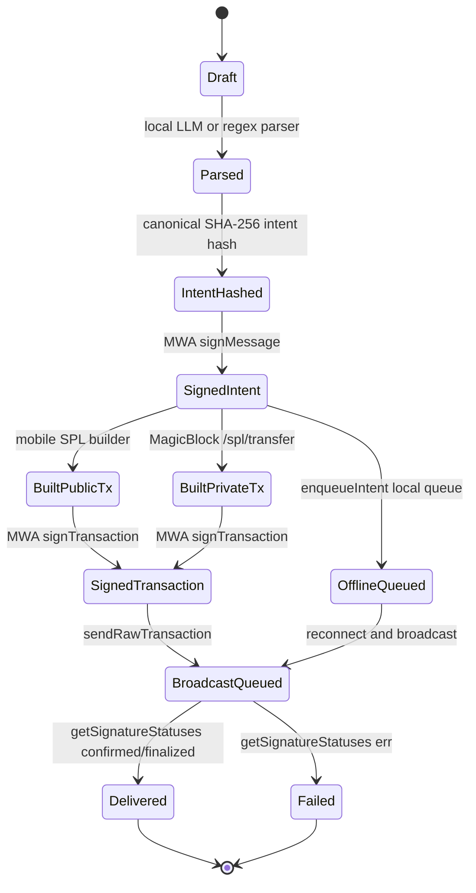
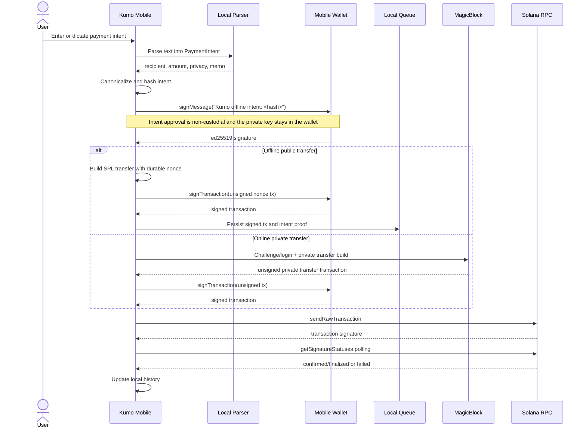
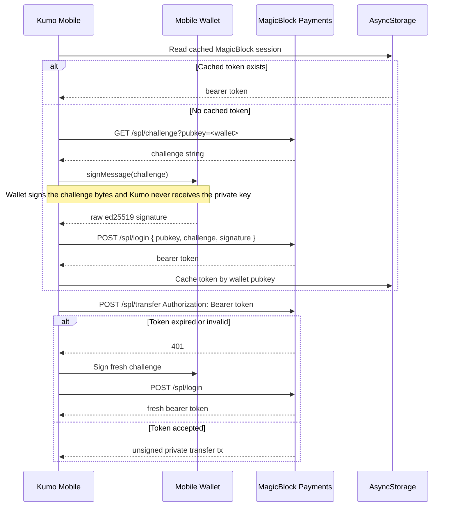

<div align="center">

# Kumo

**Offline-first USDC payments for Solana Mobile: sign now, queue locally, and settle when connectivity returns.**


[Live Demo](https://www.kumoapp.xyz) · [API Reference](#api-endpoints) · [Quick Start](#quick-start) · [Security Model](#security-model)

</div>

---

## Table of Contents

- [Overview](#overview)
  - [The Problem](#the-problem)
  - [Kumo Solves This](#kumo-solves-this)
- [Core Features](#core-features)
  - [Offline Intent Signing](#offline-intent-signing)
  - [Public SPL USDC Transfers](#public-spl-usdc-transfers)
  - [Private MagicBlock Transfers](#private-magicblock-transfers)
  - [Durable Nonce Queueing](#durable-nonce-queueing)
  - [On-Device Intent Parsing](#on-device-intent-parsing)
  - [Voice Input](#voice-input)
  - [Mobile Wallet Adapter Support](#mobile-wallet-adapter-support)
  - [Local History and Confirmation Tracking](#local-history-and-confirmation-tracking)
- [Architecture / Highlights](#architecture--highlights)
  - [Trust Boundaries](#trust-boundaries)
- [How It Works](#how-it-works)
  - [Entity Lifecycle](#entity-lifecycle)
  - [Core Flow](#core-flow)
  - [Authentication Flow](#authentication-flow)
- [Quick Start](#quick-start)
  - [Prerequisites](#prerequisites)
  - [Automated Setup](#automated-setup)
  - [Start the Application](#start-the-application)
  - [Manual Setup](#manual-setup)
  - [Connect Wallet](#connect-wallet)
- [Project Structure](#project-structure)
- [API Endpoints](#api-endpoints)
  - [Web Demo APIs](#web-demo-apis)
  - [Mobile Runtime](#mobile-runtime)
- [Environment Variables](#environment-variables)
  - [Mobile](#mobile)
  - [Web](#web)
  - [Local Parsing](#local-parsing)
- [Technology Stack](#technology-stack)
  - [Mobile App](#mobile-app)
  - [Web App](#web-app)
  - [Blockchain and Infra](#blockchain-and-infra)
  - [Security](#security)
- [Security Model](#security-model)
  - [Key Security Properties](#key-security-properties)
  - [Attack Resistance](#attack-resistance)
- [Deployment](#deployment)
  - [Web to Vercel](#web-to-vercel)
  - [Mobile to Expo EAS](#mobile-to-expo-eas)
  - [Optional Anchor Program](#optional-anchor-program)
- [Footer](#footer)

---

## Overview

Kumo is a Solana Mobile payment app that lets users create USDC payment intents, sign them locally with a wallet, store them on-device when offline, and broadcast them later. Public payments are built directly on the device with SPL Token instructions, while private payments use MagicBlock’s private payments API after a wallet-signed challenge login.

### The Problem

- Mobile payment flows break when network connectivity is unreliable.
- Most crypto payment apps require users to think in raw transactions instead of human-readable intent.
- Offline-signed Solana transactions normally expire unless they use durable nonces.
- Private payment flows often rely on a backend that becomes another trust and deployment burden.

### Kumo Solves This

Kumo keeps parsing, signing, queueing, public transfer construction, and payment history on the device wherever possible. For private payments, the mobile app authenticates directly to MagicBlock with the user’s wallet signature.

---

## Core Features

### Offline Intent Signing

Users approve a canonical payment intent by signing its hash through Mobile Wallet Adapter. The intent proof is local, non-custodial, and does not require an RPC call.

### Public SPL USDC Transfers

Public USDC transfers are built in the mobile app using `@solana/spl-token` and `@solana/web3.js`. The app creates associated token accounts idempotently and supports optional memo instructions.

### Private MagicBlock Transfers

Private mode builds transfer transactions through MagicBlock’s private payments API. The mobile app mints a MagicBlock session token directly by signing a challenge with the user’s wallet.

### Durable Nonce Queueing

Kumo can create and cache a Solana durable nonce account for offline payments. A pre-signed public transfer can survive reconnect delays because it uses the nonce value instead of a short-lived recent blockhash.

### On-Device Intent Parsing

Kumo can parse natural-language payment text using a downloaded Llama 3.2 1B GGUF model through `llama.rn`. If the model is unavailable, a deterministic regex parser still handles structured payment commands locally.

### Voice Input

Users can dictate payment instructions using local Whisper transcription through `whisper.rn` and `expo-audio`. Voice input is optional and stores the model on the device.

### Mobile Wallet Adapter Support

The native app connects to Solana wallets through Mobile Wallet Adapter. It supports wallet authorization, raw message signing, intent signing, and transaction signing.

### Local History and Confirmation Tracking

Kumo stores queued and submitted payments locally, merges them with on-chain signatures, and polls confirmation status until each payment is delivered or failed.

---

## Architecture / Highlights

```mermaid
flowchart TB
  subgraph Browser["Browser"]
    Landing["Landing Page"]
    WebMobile["/mobile Web Demo"]
    FlowDemo["/flow Walkthrough"]
  end

  subgraph Mobile["Mobile App"]
    Expo["Expo React Native"]
    Parser["Local Parser<br/>Llama / Regex"]
    Whisper["Local Whisper"]
    Queue["AsyncStorage Queue"]
    Nonce["Durable Nonce Cache"]
    MWA["Mobile Wallet Adapter"]
    PublicBuilder["SPL Transfer Builder"]
  end

  subgraph Backend["Web Demo Backend"]
    NextApi["Next.js API Routes"]
    QVAC["QVAC-Compatible Parser"]
    WebBuilder["Public Transfer Builder"]
  end

  subgraph DataLayer["Device Data Layer"]
    LocalStorage["AsyncStorage"]
    LocalHistory["Local History Store"]
  end

  subgraph ExternalServices["External Services"]
    Wallet["Solana Wallet"]
    Solana["Solana RPC"]
    MagicBlock["MagicBlock Payments"]
  end

  Landing -->|HTTPS| WebMobile
  WebMobile -->|Wallet Adapter| Wallet
  FlowDemo -->|HTTPS demo calls| NextApi
  Expo -->|local function calls| Parser
  Expo -->|local audio transcription| Whisper
  Expo -->|local tx build| PublicBuilder
  Expo -->|read/write| Queue
  Expo -->|read/write| Nonce
  Expo -->|MWA transact| MWA
  MWA -->|ed25519 signatures| Wallet
  Expo -->|REST challenge/login/transfer| MagicBlock
  Expo -->|JSON-RPC sendRawTransaction| Solana
  NextApi -->|OpenAI-compatible HTTP| QVAC
  NextApi -->|local tx build| WebBuilder
  Queue -->|persisted JSON| LocalStorage
  Expo -->|persisted JSON| LocalHistory
  PublicBuilder -->|JSON-RPC blockhash/nonce| Solana

  style Browser fill:#1e293b,color:#f8fafc
  style Mobile fill:#0f172a,color:#f8fafc
  style Backend fill:#1e293b,color:#f8fafc
  style DataLayer fill:#0f172a,color:#f8fafc
  style ExternalServices fill:#1e293b,color:#f8fafc
```



### Trust Boundaries

| Boundary | Trust Level | Verification mechanism |
| --- | --- | --- |
| User wallet to mobile app | User-controlled signer | Mobile Wallet Adapter authorization and ed25519 signatures |
| Mobile app to local queue | Trusted device storage | Intent hash, signer pubkey, and wallet signature stored with queue entry |
| Mobile app to MagicBlock | External payment service | Wallet-signed challenge and bearer session token |
| Mobile app to Solana RPC | Public network | Transaction signatures and confirmation polling |
| Web demo to Next.js API | Untrusted demo client | Zod request and response validation |
| Parser output to transaction builder | Semi-trusted local data | `PaymentIntentSchema` validation before signing |

---

## How It Works

### Entity Lifecycle



### Core Flow



### Authentication Flow



---

## Quick Start

Kumo is a hackathon MVP. Production hardening, app store packaging, and mainnet controls are still in progress.

### Prerequisites

- [Node.js 20+](https://nodejs.org/)
- [pnpm 9.15.9+](https://pnpm.io/)
- [Expo CLI / EAS CLI](https://docs.expo.dev/eas/) for mobile builds
- [Android Studio](https://developer.android.com/studio) or a Solana Mobile device for native testing
- A Solana wallet with Mobile Wallet Adapter support
- [Solana CLI](https://docs.solana.com/cli/install-solana-cli-tools) only for optional Anchor program work

### Automated Setup

```bash
git clone https://github.com/KumoPay/kumo-app.git
cd kumo-app
pnpm install
```

### Start the Application

```bash
pnpm dev
```

| Service | URL |
| --- | --- |
| Web app | http://localhost:3000 |
| Landing page | http://localhost:3000 |
| Web mobile demo | http://localhost:3000/mobile |
| Flow walkthrough | http://localhost:3000/flow |

### Manual Setup

1. Install dependencies.

```bash
pnpm install
```

2. Start the web app.

```bash
pnpm --filter web dev
```

3. Start the Expo dev client.

```bash
pnpm mobile:start
```

4. Run Android locally.

```bash
pnpm mobile:android
```

5. Typecheck both apps.

```bash
pnpm --filter mobile typecheck
pnpm --filter web typecheck
```

### Connect Wallet

1. Open the mobile app on a device or emulator with a compatible Solana wallet.
2. Choose Phantom, Solflare, or Backpack.
3. Approve the Mobile Wallet Adapter authorization request.
4. Use devnet SOL and devnet USDC for test payments.
5. Optional: open Settings and set up offline payments to create a durable nonce account.

---

## Project Structure

```text
kumo-app/                                      # Monorepo root
├── README.md                                 # Project documentation
├── package.json                              # Root scripts and pnpm workspace metadata
├── pnpm-lock.yaml                            # Locked dependency graph
├── tsconfig.base.json                        # Shared TypeScript configuration
├── apps/                                     # User-facing applications
│   ├── mobile/                               # Expo / React Native mobile app
│   │   ├── package.json                      # Mobile dependencies and scripts
│   │   ├── app.json                          # Expo app metadata
│   │   ├── index.js                          # Native app entrypoint
│   │   ├── polyfill.js                       # Runtime polyfills for Solana libraries
│   │   ├── assets/                           # Native image assets and wallet logos
│   │   └── src/                              # Mobile source code
│   │       ├── hooks/                        # Wallet, network, history, and balance hooks
│   │       ├── lib/                          # Solana, MagicBlock, parser, nonce, and config helpers
│   │       ├── screens/                      # Mobile screens and local stores
│   │       └── types/                        # Native module type shims
│   └── web/                                  # Next.js web app
│       ├── package.json                      # Web dependencies and scripts
│       ├── next.config.mjs                   # Next.js configuration
│       ├── postcss.config.mjs                # PostCSS configuration
│       ├── tailwind.config.mjs               # Tailwind content and theme configuration
│       ├── app/                              # Next.js App Router routes
│       │   ├── api/                          # Demo parser, tx builder, and broadcast routes
│       │   ├── flow/                         # Interactive payment-flow walkthrough
│       │   ├── mobile/                       # Web mobile wallet demo
│       │   ├── globals.css                   # Global styles
│       │   ├── layout.tsx                    # Root layout and metadata
│       │   └── page.tsx                      # Landing page
│       ├── components/                       # Shared web UI components
│       ├── lib/                              # Web Solana, QVAC, wallet, and transaction helpers
│       ├── public/                           # Web images, logos, mascot states, wallet art
│       └── __tests__/                        # Vitest coverage
├── packages/                                 # Shared workspace packages
│   ├── shared/                               # Shared schemas, constants, parser prompt
│   │   ├── package.json                      # Shared package metadata
│   │   └── src/index.ts                      # PaymentIntent schema and Solana constants
│   └── anchor-client/                        # Anchor client package for optional program work
└── programs/                                 # Optional Solana program workspace
    └── intent-receipt/                       # Anchor intent receipt program
        ├── Anchor.toml                       # Anchor configuration
        ├── Cargo.toml                        # Rust workspace manifest
        ├── package.json                      # Program test dependencies
        ├── programs/                         # Rust program source
        └── tests/                            # Anchor integration tests
```

---

## API Endpoints

The native mobile app does not require the Kumo web backend for core public payments. The web app still exposes development and demo APIs under `/api`.

```text
Content-Type: application/json
Authorization: Bearer <MAGICBLOCK_SESSION_KEY>
```

### Web Demo APIs

| Method | Path | Description | Auth |
| --- | --- | --- | --- |
| POST | `/api/parse-intent` | Parses natural language into a `PaymentIntent` through the QVAC-compatible client. | None |
| POST | `/api/build-private-transfer` | Builds unsigned private or durable-nonce public transfer transactions for web demo signing. | Server-side MagicBlock session when private |
| POST | `/api/build-tx` | Builds demo transactions for the web flow. | None |
| POST | `/api/broadcast` | Broadcasts signed transactions to Solana RPC or MagicBlock TEE RPC. | MagicBlock session for ephemeral route |

### Mobile Runtime

| Method | Path | Description | Auth |
| --- | --- | --- | --- |
| REST | MagicBlock `/spl/challenge` | Fetches a wallet challenge for private payment session auth. | Wallet pubkey |
| REST | MagicBlock `/spl/login` | Exchanges wallet-signed challenge for a bearer token. | Wallet signature |
| REST | MagicBlock `/spl/transfer` | Builds unsigned private transfer transactions. | Bearer token |
| JSON-RPC | Solana RPC | Reads balances, blockhashes, nonce accounts, sends transactions, and polls confirmation. | Transaction signatures |

Rate limiting is not implemented in the repository. Production deployment should add edge or gateway limits for public web API routes.

---

## Environment Variables

### Mobile

| Variable | Description | Default |
| --- | --- | --- |
| `EXPO_PUBLIC_SOLANA_RPC_URL` | Optional Solana RPC endpoint used by the native app. | `https://api.devnet.solana.com` |
| `EXPO_PUBLIC_KUMO_API_BASE_URL` | Optional web backend URL for legacy/runtime override defaults. | `http://10.0.2.2:3000` |
| `EXPO_PUBLIC_MAGICBLOCK_TEE_RPC` | MagicBlock TEE RPC endpoint for ephemeral transaction submission. | `https://devnet-tee.magicblock.app` |
| `EXPO_PUBLIC_MAGICBLOCK_BASE_URL` | MagicBlock private payments API base URL. | `https://payments.magicblock.app/v1` |
| `EXPO_PUBLIC_SOLANA_CLUSTER` | Solana cluster label used by MagicBlock transfer requests. | `devnet` |
| `EXPO_PUBLIC_APP_URI` | App identity URI shown to wallets during MWA authorization. | `https://www.kumoapp.xyz` |

### Web

| Variable | Description | Default |
| --- | --- | --- |
| `NEXT_PUBLIC_SOLANA_RPC_URL` | Solana RPC endpoint for web wallet provider and API helpers. | `https://api.devnet.solana.com` |
| `NEXT_PUBLIC_SOLANA_CLUSTER` | Cluster label exposed to the web app. | `devnet` |
| `NEXT_PUBLIC_MAGICBLOCK_TEE_RPC` | MagicBlock TEE RPC endpoint. | `https://devnet-tee.magicblock.app` |
| `NEXT_PUBLIC_MAGICBLOCK_BASE_URL` | MagicBlock private payments API base URL. | `https://payments.magicblock.app/v1` |
| `NEXT_PUBLIC_ANDROID_PLAY_STORE_URL` | Optional Android app store link shown on web. | `https://play.google.com/store` |
| `DEMO_WALLET_SECRET_KEY` | Optional demo wallet secret for legacy demo flows. | None |

### Local Parsing

| Variable | Description | Default |
| --- | --- | --- |
| `QVAC_BASE_URL` | OpenAI-compatible local parser endpoint for the web demo API. | `http://localhost:11434/v1` |
| `QVAC_MODEL` | Model name used by the parser route. | `llama-3.2-1b-instruct` |
| `MAGICBLOCK_SESSION_KEY` | Server-side MagicBlock bearer token for web API private transfer routes. | Required for server-side private transfer helpers |

---

## Technology Stack

### Mobile App

| Layer | Technology |
| --- | --- |
| Native framework | Expo `^55.0.23` |
| Runtime UI | React Native `0.83.6`, React `19.1.0` |
| Wallet integration | Solana Mobile Wallet Adapter `^2.2.8` |
| Local storage | AsyncStorage `2.2.0` |
| Network status | NetInfo `^12.0.1` |
| Local speech | `whisper.rn ^0.5.5`, `expo-audio ~55.0.14` |
| Local LLM | `llama.rn ^0.12.0`, `expo-file-system ~55.0.19` |
| Biometrics | `expo-local-authentication ~55.0.13` |

### Web App

| Layer | Technology |
| --- | --- |
| Web framework | Next.js `^15.0.0` |
| Web UI | React `^18.3.1`, TailwindCSS `^3.4.13` |
| Animation | Framer Motion `^12.38.0` |
| Web wallet | Solana Wallet Adapter React `^0.15.39` |
| Testing | Vitest `^2.0.0` |

### Blockchain and Infra

| Layer | Technology |
| --- | --- |
| Chain | Solana devnet |
| Token standard | SPL Token via `@solana/spl-token ^0.4.14` |
| Solana client | `@solana/web3.js ^1.95.4` |
| Private payments | MagicBlock Private Payments API |
| Offline validity | Solana durable nonce accounts |
| Optional program | Anchor `^0.31.1` |

### Security

| Layer | Technology |
| --- | --- |
| Auth model | Wallet-based ed25519 signatures |
| Mobile private payment auth | MagicBlock challenge/login bearer sessions |
| Intent validation | Zod schemas in `@kumo/shared` |
| Local authorization | Optional biometric prompt before signing |
| Transaction persistence | Device-local AsyncStorage queue |

---

## Security Model

Kumo’s core security model is non-custodial signing. The user’s wallet owns the signing keys, and Kumo only receives signatures, signed transactions, or session tokens minted from wallet-signed challenges.

### Key Security Properties

| Property | Implementation |
| --- | --- |
| Non-custodial signing | Private keys stay in the wallet; Kumo uses Mobile Wallet Adapter for signatures. |
| Intent integrity | The app hashes a canonical intent and stores the wallet signature over that hash. |
| Offline transaction validity | Public offline payments use durable nonce accounts instead of expiring blockhashes. |
| Private transfer authorization | MagicBlock sessions are minted from wallet-signed challenges and cached per pubkey. |
| Local parsing fallback | Structured payment commands can be parsed on-device without a cloud parser. |
| Optional biometric gating | Users can require biometric approval before signing or confirming payments. |

### Attack Resistance

| Attack Vector | Status | Mechanism |
| --- | --- | --- |
| Private key exfiltration | ✅ Mitigated | Keys never enter Kumo; wallets sign through MWA. |
| Intent tampering after approval | ✅ Mitigated | Signed intent hash binds recipient, amount, memo, and privacy mode. |
| Expired offline transaction | ✅ Mitigated | Durable nonce blockhash keeps public offline transactions valid until nonce advancement. |
| Replay of private payment auth challenge | ✅ Mitigated | MagicBlock challenge/login issues bearer sessions tied to wallet signatures. |
| Backend dependency for mobile public payments | ✅ Mitigated | Native app builds public SPL transfers locally. |
| Invalid parser output | ✅ Mitigated | Payment intents are validated with Zod schemas before signing. |

---

## Deployment

### Web to Vercel

```bash
pnpm install
pnpm --filter web build
vercel --prod
```

| Setting | Value |
| --- | --- |
| Root directory | `apps/web` |
| Framework | Next.js |
| Install command | `pnpm install` |
| Build command | `pnpm build` |
| Node version | `20+` |

### Mobile to Expo EAS

```bash
pnpm install
cd apps/mobile
eas build -p android --profile preview
```

Production Android build:

```bash
cd apps/mobile
eas build -p android --profile production
```

Local Android dev-client build:

```bash
pnpm mobile:android
```

### Optional Anchor Program

The Anchor program is optional and is not required for the mobile payment flow.

```bash
pnpm anchor:build
cd programs/intent-receipt
anchor test --skip-deploy
```

Deploy to devnet only if the receipt program is part of your demo:

```bash
cd programs/intent-receipt
anchor deploy --provider.cluster devnet
```

---

## Footer

<div align="center">

**Kumo makes Solana payments resilient: sign locally, queue safely, and settle when the network comes back.**

</div>
